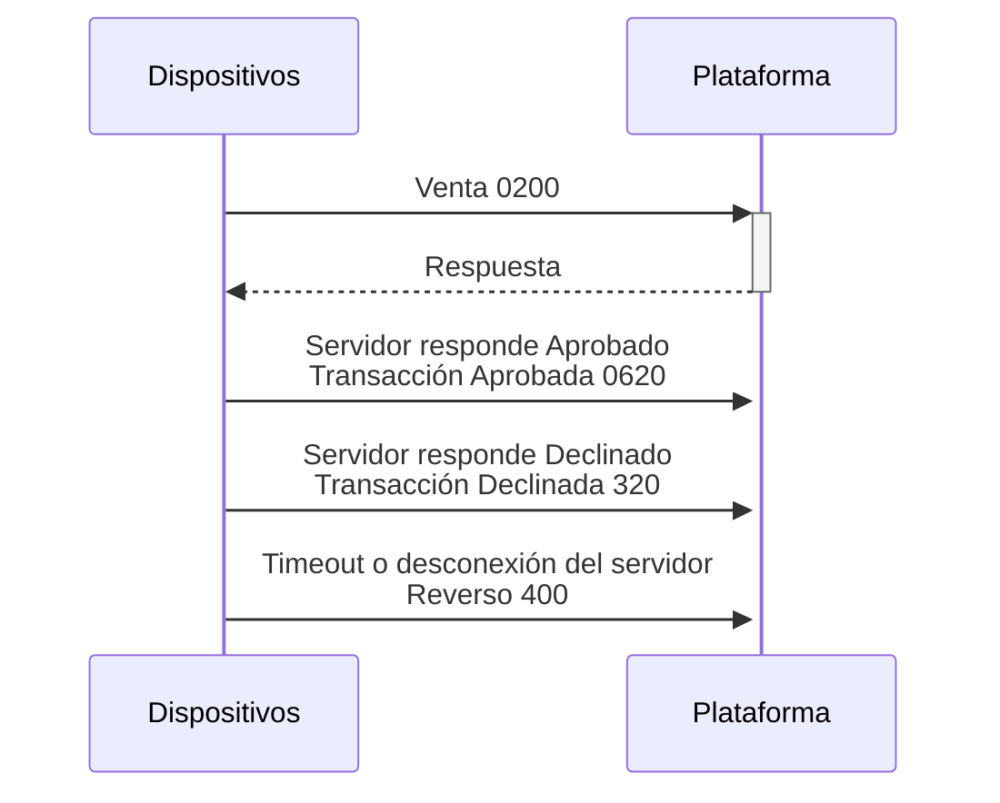
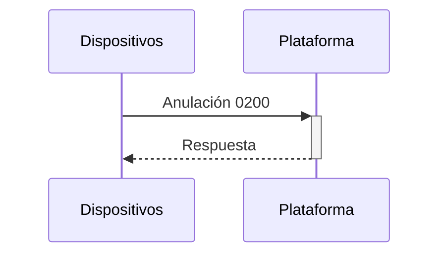

# Especificacion Digipay
## Plataforma V1
### Desarrollo de Aplicacion Cliente
### Table of Contents
1. [API](#api)
    1. [Operaciones](#operaciones)
    2. [Validación de terminal](#validación-de-terminal)
    3. [Lista de transacciones](#lista-de-transacciones)
    4. [Resumen de Lote](#resumen-de-lote)
    5. [Venta, Reverso, Anulación y Advice](#venta-reverso-anulación-y-advice)
2. [TLV](#tlv)
    1. [Flujo del mensaje](#flujo-del-mensaje)
    2. [Formato de datos](#formato-de-datos)
    3. [Formato de las etiquetas](#formato-de-las-etiquetas)
    4. [Cifrado de datos](#cifrado-de-datos)
3. [APPENDICE](#appendice)
    1. [Ejemplos](#ejemplos)
    2. [Etiquetas](#etiquetas)

## API
### Operaciones
####  1. Base
Todos los apuntan a nuestro API Gateway `https://example.com`
Dependiendo del caso se apuntaran a los diferentes métodos

#### 2. `Test1 --> api-echo`
El método api-echo provee acceso a las funcionalidades base del sistema, junto con su versión son parte del URL base, todos los métodos serán ejecutados en base
a el `https://example.com/api-echo/v1/`

[Operaciones disponibles: - Validación de Terminal - Resumen de Lote - Lista de transacciones - Venta, Reverso, Anulación y Advice](#OperacionesDisponibles)

### Validación de terminal
#### 1. Request

```yml 
[GET] /resumen/{taxID}/{serial}/?query
URL parameters:
- taxID [req]: RIF del comercio
- serial [req]: Serial del dispositivo POS
query parameters:
- ksn [opt]: Key Serial Number
- appName [opt]: Nombre de Aplicacion
- appVersion [opt]: Version de Aplicacion
```
> [!TIP]
> Recomendación </br>
> El Afilliation **DigipayID**, es un identificador único entre un comercio afiliado y un serial de terminal en caso del comercio tener varios terminales cada uno tendrá un id
único de afiliación.

>[!WARNING]
> **Atención**
> Un serial de terminal puede pertenecer a varios comercios si esta en modo multimerchant


#### 2. Response
De ser exitoso, la respuesta retorna un JSON con los siguientes parámetros

```yml
id:
    [int] DigipayID
merchant:
    [str] El nombre del comercio
terminal:
    [str] Información del terminal
lotNumber:
    [str] Numero de lotes
stan:
    [str] System Trace Audit Number
statusId:
    [int] ID Status
description:
    [str] Descripción Status
commerceId:
    [int] ID del comercio
taxId:
    [str] RIF del comercio
name:
    [str] Nombre comercial
address:
    [str] Dirección comercial
commerceStatusId:
    [int] Status del comercio
deviceId:
    [int] ID del dispositivo
serial:
    [str] Serial del terminal
deviceStatusId:
    [int] Status del dispositivo
urlBase:
    [str] Url Base para las API
key001:
    [str] Key 001 DUKPT
key002:
    [str] Key 002 DUKPT
ksn:
    [str] Key Serial Number
processorName:
    [str] No nombre del procesador
ipAddress:
    [str] El IP del procesador
ipPort:
    [str] El puerto del procesador
acquirerName:
    [str] Nombre del banco responsable
acquirerValue:
    [str] ID del banco responsable
acquirerTaxId:
    [str] RIF del banco reponsable
header:
    [str] Informacion cabecera

```
### Lista de transacciones
#### 1. Request

```yml
[GET] /transactions/{MerchantID}/{terminalID}?params

URL parameters:
    - MerchantID [req]: ID del Merchant
    - terminalID [req]: ID del terminal

query parameters:
    - origin: Muestra firma
    - all: retorna todos los tipos de recibos
    - cantidad: retorna las ultimas n del lote
    - batches: retorna los cierres
    - lotNumber: si esta retorna el solicitado si no el ultimo
```
Genera la lista de transacciones en base al lote actual la transaccion de debito no lleva firma

#### 2. Response
De ser exitoso, la respuesta retorna una lista en json donde cada elemento tiene los siguientes parámetros

```yml
id:
    [int]
tranDate:
    [str] Fecha de la transacción
serial:
    [str] Serial del merchant
taxId:
    [str] Rif del merchant
mit:
    [str]
lotNumber:
    [str] Numero de lote
affiliationId:
    [int] ID
applicationIdentifier:
    [str] Identificacion Aplicacion
applicationLabel:
    [str] Etiqueta de Aplicacion
upn:
    [str] Unpredictable number
d002:
    [str] PAN (Primary account number)
d003:
    [str] Precessing code
d004:
    [str] Transaction amount
d007:
    [str] Transmission datetime (MMddhhmmss)
d011:
    [str] STAN (Systems trace audit number)
d012:
    [str] Time transaction (hhmmss)
d022:
    [str] PIN/PAN entry mode
d024:
    [str] Network International identifier
d037:
    [str] Retrieval reference number
d038:
    [str] Authorisation identification response
d039:
    [str] Response code
d041:
    [str] Card acceptor terminal identification
d042:
    [str] Card acceptor identification code
tranDateResp:
    [str] Marca de tiempo de respuesta
receipt:
    [str] Recibo
signature:
    [str] Firma del cliente
```
### Resumen de Lote
#### 1. Request
```yml
[GET] /resumen/transactions/?query

query parameters:
    - affiliationId [req]: DigipayID
```

Genera el resumen del lote, el **DigipayID** es se obtiene al realizar una [Validación de Terminal](#validación_terminal)

>[!INFO]
>Recomendación
> Se recomienda mantener un Base de datos local con las transacciones del lote actual. Cuando se ejecute esta función se debe comparar los totales locales con los
recibidos, si los datos no están homologados, se recomienda solicitar todas las transacciones del lote para homologar la data

#### 2. Response
De ser exitoso, la respuesta retorna un json con los siguientes parámetros

```yml
lotNumber:
    [int] Número del Lote
quantityRefund:
    [int] Cantidad de anulaciones
amountRefund:
    [str] Monto de anulaciones
quantitySales:
    [int] Cantidad de ventas
amountSales:
    [str] Monto total de ventas
quantitySalesDebitApproved:
    [int] Cantidad de ventas por débito
amountSalesDebitApproved:
    [str] Monto de ventas por débito
quantitySalesCreditApproved:
    [int] Cantidad de ventas por creédito
amountSalesCreditApproved:
    [str] Monto de ventas por creédito
```

### Venta, Reverso, Anulación y Advice

#### 1. Request
```yml
[POST] /transactions/
```
Para registrar una transacción se envía un post con el correspondiente mensaje en TLV en el body del mensaje


>[!NOTE]
> - El uso del **Tag 50** es usado para determinar si la tarjeta es Visa o MC Debit
> - No se certifica banda magnética, ni Fallback
> - Al realizar una **Venta**, el TLV debe almacenarse en memoria para ser reenviado durante operaciones **Reverso** o **Advice** 
> - El **Advice** debe enviarse después de cada venta.
> - Un **Advice** no exitoso puede generarse por rechazo de una tarjeta de contacto que rechace el criptograma de vuelta.
> - La firma se envía en **TAG DF832A** \u0002 en formato jpeg codificado en Base64 y finalizado en \u0003
> - \u0002 representa start of text, y \u0003 representa end of text


>[!WARNING]
>Atención</br>
> Sebe debe Usar UPN para verificaciones antes de enviar ventas para evitar envío de duplicados


>[!DANGER]
>¡Cuidado!</br>
>En caso de **Venta** o **Anulación** se deben verificar reversos pendientes. Si el reverso no es respondido `No debe ejecutarse esta operación`

#### 2. Response
```yml
status:
    [int] Tag 8A (Authentication Response Code)
recibo: (Solo Venta y Anulación) 
    [str] Tag DF832A (Receipt)
```

## TLV
### Flujo del mensaje
#### 1. Tipo de mensaje
La etiqueta DF8330 indica el tipo de mensaje de la transacción actual

| Tipo                  | Condición| Código solicitud | Descripción                                                                  |
|-----------------------|----------|------------------|------------------------------------------------------------------------------|
| Venta                 | Manual   | 200              | Transacción de venta                                                         |
| Completado            | Advice   | 220              | Completar una transacción autorizada                                         |
| Anulación             | Manual   | 222              | Anular una venta, completado o transacción de reembolso previamente aprobada |
| Reverso               | Advice   | 400              | Revertir una transacción fallida                                             |
| Transacción aprobada  | Advice   | 620              | Indica al servidor que recibió aprobado                                      |
| Transacción declinada | Advice   | 320              | Indica al servidor que recibió declinado                                     |

#### 2. Venta
**Transacción EMV completa, Autorización**




1. Se envía una solicitud de venta con el ARQC para autorización
2. El emisor responde con ARC/ARPC a la tarjeta.
3. Si la transacción es aprobada por la tarjeta, se envían de vuelta al servidor los datos del lote, incluyendo la aprobación (0620) 
4. Si la transacción es rechazada o terminada, se envía un mensaje de transacción declinada (0320) para notificar al servidor.

#### Anulación
Esta implementación es especifica. Igualmente diferentes sistemas de pago tienen diferentes requisitos de datos necesarios en el mensaje de reversión y anulación. Sin embargo, una reversión o anulación debe estar relacionada con una transacción previa.

En la mayoría de los casos, la reversión y la anulación se realizarán de inmediato cuando ocurra un problema con una transacción en curso o una transacción que acaba de finalizar. Al igual que con el reembolso anterior, puede ser necesaria una lectura completa de la tarjeta.




### Formato de datos
#### 1. El formato TLV
Los datos que se envían al servidor de pagos se codifican en Formato TLV y están alineados a la data de el [SDK]. Este mensaje contiene dos etiquetas fundamentales, **C0** y **C2**, donde **C0** se utiliza para derivar la clave de cifrado y **C2** contiene los datos cifrados. A partir de la información descifrada, el servidor puede extraer los detalles de la transacción para enviarlo al siguiente nodo de procesamiento, ya sea una pasarela de red de pagos o una pasarela de emisor.

Cada objeto de datos TLV consta de 2 o 3 campos consecutivos
    
-  **Tag** (Etiqueta): Indica una [Clase](https://es.wikipedia.org/wiki/ASN.1#Clases_de_datos), un [Tipo](https://es.wikipedia.org/wiki/ASN.1#Tipos_primitivos) y un número. En las especificaciones EMV contact las etiquetas son de 1 o 2 bytes. En otros usos, puede ser de hasta
3 bytes. Puede consultar aquí mas detalle del formato Formato de las etiquetas
- Length (Largo): Indica el largo del campo siguiente.
- Value (Valor): Contenido de la data.

>[!INFO]
>Atención
>Si el campo Length contiene un valor 0, el campo Value no estará presente

Un objeto de datos TLV puede ser un objeto de datos primitivo o compuesto. En el caso de un campo compuesto, a el campo Value se llamará Template (plantilla)


>[!NOTE]
>Según EMV 4.3 Libro 3, es posible tener bytes '00' antes, entre o después de los objetos TLV, por lo tanto, el analizador debería poder manejar estos bytes de relleno correctamente.
#### 2. Etiquetas EMV


Las etiquetas EMV son standard y son soportadas por diferentes plataformas de pago así mismo habrán etiquetas especificas de cada plataforma.

Tarjetas ICC: las etiquetas incluidas en C2 pueden ser personalizadas en ???.

Tarjetas contactless: las etiquetas incluidas son dependientes del kernel del contacless, diferentes esquemas tienen sus propios requerimientos. 

Tarjetas de cinta magnética Para estas tarjetas serán tomados prestados campos EMV para mantener un formato unificado


#### 3.   Lista De etiquetas

- [EMVCo Tags]() 
- [Custom Tags]()

#### 4. Respuesta de datos
La respuesta del servidor también usa formato TLV, sin embargo, no requiere cifrado.


|Tag | Contenido                    | Descripción                                                                                             |
|----|------------------------------------------|---------------------------------------------------------------------------------------------------------|
|71  | Issuer Script Template 1<br> (Opcional)  | Scripts para actualizar datos en la tarjeta. Solo son aplicables al flujo completo de transacción EMV.  | 
|72  | Issuer Script Template 2<br>  (Opcional) | Scripts para actualizar datos en la tarjeta. Solo son aplicables al flujo completo de transacción EMV.  |
|8A  | Authorisation Response Code<br>(ARC)     | Este es un código de respuesta de dos dígitos del emisor. "00" significa Aprobación. Todos los demás <br> valores significan Rechazo.    | 
|91  | Issuer Authentication Data<br>(Opcional) | Este campo es devuelto por el emisor y contiene ARPC y otros datos a discresión                         |

### Formato de las etiquetas
#### 1. Estructura de las etiquetas


| b8  | b7  |  b6 |  b5 | b4  |  b3 |  b2 | b1  |  Significado                 | 
|-----|-----|-----|-----|-----|-----|-----|-----|------------------------------|
|  0  |  0  |     |     |     |     |     |     | ClaseUniversal               | 
|  0  |  1  |     |     |     |     |     |     |  ClasedeAplicación           |
|  1  |  0  |     |     |     |     |     |     | Clasedecontextoespecifico    | 
|  1  |  1  |     |     |     |     |     |     | Claseprivada                 |
|     |     |  0  |     |     |     |     |     | TipoPrimitivo                | 
|     |     |  1  |     |     |     |     |     | ClasedeAplicación            | 
|     |     |     |  X  |  X  |  X  |  X  |  X  | ValordelTag(sib5-b1noes11111)| 
|     |     |     |  1  |  1  |  1  |  1  |  1  | IndicaproximoByteespartedelTag 


Si hay un próximo byte en el tag


| b8  | b7  | b6  | b5  | b4  | b3  | b2  | b1  | Significado                         | 
|:----|:---:|:---:|:---:|:---:|:---:|:---:|:---:|------------------------------------:|
|  0  |     |     |     |     |     |     |     | EsteeselultimobyteenelTag           | 
|  1  |     |     |     |     |     |     |     | HaymasbytesdelTag                   |
|     |     |     |  X  |  X  |  X  |  X  |  X  | ValordelTag(sib5-b1noes11111)       |

`CAMPO TAG (ETIQUETA)`

| Patron | Significado                                      |  Rango                                                   | Ejemplo     |
|--------|--------------------------------------------------|----------------------------------------------------------|-------------|
| 5Fxx   | Clase de aplicacion, objeto primitivo            | 5F57 Account Type                                        |             | 
| 7Fxx   | Clase de aplicacion, objeto comp                 | Raramente usado                                          |             |
| 9Fxx   | Clase de contexto especifico, objeto primittivo  | **9F00 al 9F4F** está reservado para <br> EMV. <br>**9F50   al 9F7F** está reservad
| BFxx   | Clase de contexto e BF20 al BF4F está reservado para <br>EMV.<br>BF10 al BF1F está reservado para sistemas de pago.<br>BF01 al BF0F está reservado para el emisor | BF0C, FCI Template. <br> (EMVCo)
| DFxx   | Clase privada, Objeto primitivo                  | DF31 (CUP)
| FFxx   | Clase privada, objeto coompuesto                 | FF8240 EMV Report (Custom)


`CAMPO LENGTH (LARGO)`


| Largo     | Patrón       | Descripción |
|:----------|:------------:|------------:|
| 0 - 127   |  xx          | El largo del campo tiene un solo byte cuando b8 es 0. El numero de bytes estará representado en los bits b1 a b7
hasta 255   | 81 xx        | Si el primer byte es 0x81, el numero de bytes en el campo valor estará codificado en el próximo byte
hasta 65535 | 82 xx xx     | Si el primer byte es 0x82, el numero de bytes en el campo valor estará codificado en los 2 próximos bytes.<br> Ej. Si el valor es 0x82 0x01 0x00, entonces el campo valor tendrá un largo de 256 bytes
mayores     | 83 xx xx xx  | Si el primer byte es 0x83, el numero de bytes en el campo valor estará codificado en los 3 próximos bytes.


>[!NOTE]
>El programa debe ser capaz de manejar casos donde el campo largo usa un patron mas largo que el requerido, <br> es decir, para un campo de 64 bytes los siguientes casos son validos:
> - 0x40
> - 0x81 0x40
> - 0x82 0x00 0x40
> - 0x83 0x00 0x00 0x40


>[!NOTE]
>Nota
>Si el campo Length contiene un valor 0x00, el campo Value no estará presente

- [EMVCo Tags]()
- [Custom Tags]()


### Cifrado de datos
#### 1. Base
Para proporcionar seguridad de extremo a extremo, los datos se protegen a nivel de mensaje. Se utiliza el algoritmo DUKPT para generar la clave y entonces cifrar con Triple DES los datos EMV que se envían al servidor.

#### 2. Formato de bloque de PIN cifrado (EPB)
El bloque de PIn cifrado (EPB) online representado por la etiqueta 99, usa [ISO9564-1 Formato 0](https://en.wikipedia.org/wiki/ISO_9564#Format_0) que es equivalente al Formato 0 de Bloque de PIN ANSI X9.8. 

El Bloque de PIN en texto plano es resultado del XOR entre el resultado de un campo de datos de PIN de 8 bytes y el campo de datos PAN de 8 bytes


**Campo de datos de PIN:**

- El primer segmento se establece en 0x0 indica "Formato 0".
- El segundo segmento N indica el la cantidad de dígitos, 4-12 (0x4 a 0xC) en el PIN. 
- Cada uno de los segmentos siguientes contiene un dígito PIN o un valor de relleno 'F'.


 |0 |  |1 |  |2 |  |3 |  |4 |  |5 |  |6 |   |7 |   |8 |   |9 |   |A |   |B |   |C |   |D |   |E |   | F|
 |--|--|--|--|--|--|--|--|--|--|--|--|--|---|--|---|--|---|--|---|--|---|--|---|--|---|--|---|--|---|--|
 |  |0 |  |N |  |P |  |P |  |P |  |P |  |P/F|  |P/F|  |P/F|  |P/F|  |P/F|  |P/F|  |P/F|  |P/F|  |P/F|  | 
 

>[!NOTE]
>Atención
>Cada "segmento" de este campo es representado por 4 bits, es decir, medio byte o 1 carácter hexadecimal

El bloque de PIN es cifrado por la clave de trabajo DUKPT derivada de un BKD utilizando el KSN contenido en la etiqueta custom C1. Siempre tiene una longitud 
de 8 bytes, por lo que no se requiere relleno de datos para que sea un múltiplo de 8 bytes.

No se genera un bloque de PIN encriptado cuando se utiliza el PIN sin offline como el método de verificación.

#### 3. Formato de datos cifrados del EMV

Los datos EMV se completan hasta un múltiplo de 8 utilizando el PKCS7 como se describe en el RFC 5652. 

Luego, los datos son cifrados con la clave DUKPT derivada de un BDK utilizando el KSN contenido en la etiqueta custom C0. 

Por defecto es usado el modo de cifrado CBC con un IV (vector de inicialización) de ceros.


>[!NOTE]
>Nota
>El termino EMV está siendo usado en un sentido abierto, donde puede referirse a tarjetas contactless o de cinta magnetica


#### 4. Requerimientos PCI
Desarrolladores e integradores deben estar al tanto de los requisitos PCI

El PIN en texto plano solo puede existir en ciertos entornos:

- NUNCA descifrar el EPB en texto plano.
- Solo traducir el EPB utilizando un HSM aprobado por PCI o un módulo criptográfico de una clave PIN a otra clave PIN.
- No almacenar el EPB en ningún lugar y debe ser eliminado después de que termine el procesamiento.
- Debido a que la etiqueta C2 puede contener datos de pista (etiqueta 57) y datos de EPB (etiqueta 99), no debe almacenarse en ningún lugar dentro del sistema.


Los datos del titular de la tarjeta en texto plano y los datos sensibles deben manejarse de acuerdo con los requisitos. Aquí está la guía:

- Descifrar y procesar datos del titular de la tarjeta en texto plano solo en un entorno aprobado por PCI-DSS. 
- No almacenar datos de pista en ningún lugar y deben ser eliminados después de que termine el procesamiento.
- PAN (etiqueta 5A), si se almacena, debe ser truncado o encriptado. Como máximo, los primeros 6 y últimos 4 dígitos deben mostrarse. <br> El formato recomendado para la visualización y el recibo es solo los últimos 4 dígitos con otros dígitos enmascarados.
- Debido a que la etiqueta C2 puede contener PAN completo (etiqueta 5A), datos de pista (etiqueta 57) y datos de EPB (etiqueta 99), <br> no debe ser almacenada en ningún lugar dentro del sistema.


## APPENDICE
### Ejemplos
#### 1. Data de ejemplo cifrada
>[!NOTE]
>Nota
>Los datos a continuación están para fines explicativos y deben ser tomados con cuidado, ya que pueden provenir de transacciones 
>que han sino anonimizadas o han sido creados con el fin de expresar una idea general.


>[!NOTE]
>Atención
>El orden de las etiquetas en el código no es estricta, es decir, <br> su orden puede cambiar libremente según la implementación

|Parametro  | Valor                                | 
|:--        |                             :---     |
| Test BDK  | 01234567 89ABCDEF FEDCBA98 76543210  |
| IV        | 00000000 00000000                    |
| Padding   | PKCS7
| Chain Mode| CBC

```
C00AEFFF9876543210E00133C10AFFFF9876543210E00020C2820178894447FB4E4819EC9132549E 
3C5AC1ACCB8B68B09470854472F2F0796BE55274EF44507F4B2000359F0847454B17B87DCBB35EBD 
AED95311E6C3E53E2FD19ECEF67DF6E3DA18C5128EFACE66126B482745AEFDA8D9D12B6D0FB97E20 
6938821FF2CE247230DEF84FE9C7459287B9998F458445C3048CE91CFA779ED1FC3162697C2F276B 
281B6A08C72EFEA8AB0E9182462C0F0CC18BC96E1E2B2C3FF24CFAE67844C43A884F864177785E24 
0B50D7CDF7FB475EA22E99C1DA60330968D126E86C64F3AAFE02450E439E44366E8CF9CF7E7A9248 
17B383E45F1A648B66826DC579320F6FCD4593A7AC97A805DF2DE2DEB5E213012EEF8FF2F41BA9A2 
69E278F3D0918CA7A4FF31F6C09420035F1701D4606AB9621EED1E0FE27FE32406A22E1275A4AFB1 
D182F0740A31A986B4EF8F5033995714A3FB9F6573C1706BE26B2A1644257CA5F19B2E3B55B22172 
71A355E844789238D3D129AA79C2B07F43011402A4D8524B2B3E1FEBBDAC57138F12752C992517C3 
E311353A
```
Podemos dividir la data tomando en cuenta lo que vemos en Formato de las etiquetas

| Tag | Largo           | Valor                  | Largo  data            |
| --  | ----            | -----                  |       --------------   |  
|C0   |0A = 10          | 0AEFFF9876543210E00133 | KSN Data Key           |
|C1   |0A = 10          | 0AFFFF9876543210E00020 | KSN Pin Key            |
|C2   |820178 = 376     | 8944 ... 353A          |  Data cifrada          |


`C00A`
```yml
Tag: C0

0     1     2     3     4     5     6     7     8 
+-----+-----+-----+-----+-----+-----+-----+-----+ 
|  1  |  1  |  0  |  0  |  0  |  0  | 0   |   0 | 
+-----+-----+-----+-----+-----+-----+-----+-----+

 - Clase Privada 
 - Tipo Primitivo 
 - Valor: 0

Largo: 0A

0     1     2     3     4     5     6     7     8 
+-----+-----+-----+-----+-----+-----+-----+-----+ 
|  0  |  0  |  0  |  0  |  1  |  0  |  1  |  0  | 
+-----+-----+-----+-----+-----+-----+-----+-----+

- Largo de etiqueta 1 Byte 
- 0x0A = 10

```
`C10A`
```yml
Tag: C1
0     1     2     3     4     5     6     7     8 
+-----+-----+-----+-----+-----+-----+-----+-----+ 
|  1  |  1  |  0  |  0  |  0  |  0  |   0 |  1  | 
+-----+-----+-----+-----+-----+-----+-----+-----+

- Clase Privada
- Tipo Primitivo 
- Valor: 1

Largo: 0A


0     1     2     3     4     5     6     7     8 
+-----+-----+-----+-----+-----+-----+-----+-----+ 
|  0  |  0  |  0  |  0  |  1  |  0  |  1  |  0  | 
+-----+-----+-----+-----+-----+-----+-----+-----+

- Largo de etiqueta 1 Byte 
- 0x0A = 10

```

`C2820178`
```yml
Tag: C2
0     1     2     3     4     5     6     7     8 
+-----+-----+-----+-----+-----+-----+-----+-----+ 
|  1  |  1  |  0  |  0  |  0  |  0  |  1  |  0  | 
+-----+-----+-----+-----+-----+-----+-----+-----+

- Clase Privada 
- Tipo Primitivo - Valor: 2


Largo: 820178


0     1     2     3     4     5     6     7     8 
+-----+-----+-----+-----+-----+-----+-----+-----+ 
|  1  |  0  |  0  |  0  |  0  |  0  |  1  |  0  | 
+-----+-----+-----+-----+-----+-----+-----+-----+ 
|  0  |  0  |  0  |  0  |  0  |  0  |  0  |  1  | 
+-----+-----+-----+-----+-----+-----+-----+-----+ 
|  0  |  1  |  1  |  1  |  1  |  0  |  0  |  0  | 
+-----+-----+-----+-----+-----+-----+-----+-----+

- Largo de etiqueta 2 Bytes 
    - bit[0] = 1
        Indica que hay mas bytes del Tag 
    - bits[3 a 7] = 2
        Indica la cantidad de bytes extra del tag 
    - bits siguientes = 0x0178
        Indica que el largo es de 0x0178 bytes (376 bytes)

        
```

| TAG | Clase  | Tipo | Valor del tag
| -- |     --       |         --             |     --          |
| C0 | 0A = 10      | 0AEFFF9876543210E00133 |  KSN Data Key   |
| C1 | 0A = 10      | 0AFFFF9876543210E00020 | KSN Pin Key     |
| C2 | 820178 = 376 | 8944 ... 353A          | Data cifrada    |

La llave recuperada es: `91BE1497 24ADB022 C81CB55E 7303883F`


La data descifrada es:
```yml
5713377106286350004D100710107072317800002F5A08377106286350004F950500000000009A03 
5001089B0200009C01005F201A54414E4720544149204B57414E204A494D4D59202020202020205F 
24031007105F2A0208405F300210109F02060000000012349F160F4D4F434B303030303030000000 
00009F1A0208409F1C0831313232333334349F1E0831323334353637389F21031936379F330360F8 
C89F3501219F370448C4ACC19F3901909F40057E0020B0019F41030003049F4E0D54657374204D65 
726368616E74DF8330020200

```
El análisis de la data lo podemos ver en [TLV Decodificado](#2_-tlv-decodificado)

#### 2_ TLV Decodificado
Con la siguiente data podemos ver como se dividen los tags y sus valores

```yml
5713377106286350004D100710107072317800002F5A08377106286350004F950500000000009A03 
5001089B0200009C01005F201A54414E4720544149204B57414E204A494D4D59202020202020205F 
24031007105F2A0208405F300210109F02060000000012349F160F4D4F434B303030303030000000 
00009F1A0208409F1C0831313232333334349F1E0831323334353637389F21031936379F330360F8 
C89F3501219F370448C4ACC19F3901909F40057E0020B0019F41030003049F4E0D54657374204D65 
726368616E74DF8330020200

```

| Tag / Significado | Largo hex / <br> dec | Valor |
|         --        |         --      |   --  |
| 57 / Track 2                          | 13 / 19   | 377106286350004D100710107072317800002F |
| 5A / PAN                              | 08 / 8    | 377106286350004F
| 95 / TVR                              | 05 / 5    | 0000000000
| 9A / Transaction Date                 | 03 / 3    | 500108
| 9B / TSI                              | 02 / 2    | 0000
| 9C / Transaction Type                 | 01 / 1    |  00
| 5F20 / Cardholder Name                | 1A / 26   | 54414E4720544149204B57414E204A494D4D5920202020202020 <br> (TANG TAI KWAN JIMMY)
| 5F24 / Application Expiration Date    | 03 / 3    | 100710
| 5F2A / Transaction Currency Code      |  02 / 2   | 0840
| 5F30 / Service Code                   | 02 / 2    | 1010
| 9F02 / Amount, Authorised             | 06 / 6    | 000000001234 (12.34)
| 9F16 / Merchant Identifier            | 0F / 15   | 4D4F434B3030303030300000000000 (MOCK000000)
| 9F1A / Terminal Country Code          | 02 / 2    | 0840
| 9F1C / Terminal Identification        | 08 / 8    | 3131323233333434 (11223344)
| 9F1E / Interface Device               | 08 / 8    | 3132333435363738 (12345678)
| 9F21 / Transaction Time               | 03 / 3    | 193637
| 9F33 / Terminal Capabilities          | 03 / 3    | 60F8C8
| 9F35 / Terminal Type                  | 01 / 1    | 21
| 9F37 / Unpredictable Number           | 04 / 4    | 48C4ACC1
| 9F39 / POS Entry Mode                 | 01 / 1    | 90
| 9F40 / Additional Terminal            | 05 / 5    | 7E0020B001 Capabilities
| 9F41 / Transaction Sequence           | 03 / 3    | 000304 Counter
| 9F4E / Merchant Name and              | 0D / 13   | 54657374204D65726368616E74 <br> (Test Merchant) Location
| DF8330 / MIT                          | 02 / 2    | 0200
#### 3_ TLV Compra con credito
```yml
9F2608C6D4E559DC295C0B9F2701809F100706010A03A000009F3704B8268C929F36020356950500 400080009A031102159C01009F02060000000010005F2A02093782025C009F1A0208629F34031E03 009F3303E0F8C89F03060000000000009F1E0832303833333536369F21031113229F350122
```

Tag / Significado | Largo hex / dec     | Valor
|-----------                            |------  | ----        |
9F26 / Application Cryptogram           | 08 / 8 | C6D4E559DC295C0B
9F27 / Cryptogram Information Data      | 01 / 1 | 80
9F10 / Issuer Application Data          | 07 / 7 | 06010A03A00000
9F37 / Unpredictable Number             | 04 / 4 | B8268C92
9F36 / Application Transaction Counter  | 02 / 2 | 0356
95 / TVR                                | 05 / 5 | 0040008000
9A / Transaction Date                   | 03 / 3 | 110215
9C / Transaction Type                   | 01 / 1 | 00
9F02 / Amount, Authorised               | 06 / 6 | 000000001000
5F2A / Transaction Currency Code        | 02 / 2 | 0937
82 / Application Interchange Profile    | 02 / 2 | 5C00
9F1A / Terminal Country Code            | 02 / 2 | 0862
9F34 / Cardholder Verification Method   | 03 / 3 | 1E0300
9F33 / Terminal Capabilities            | 03 / 3 | E0F8C8
9F03 / Amount, Other                    | 06 / 6 | 000000000000
9F1E / Interface Device (IFD) Serial Number | 08 / 8 | 3230383333353636 (20833566)
9F21 / Transaction Time                 | 03 / 3 | 111322
9F35 / Terminal Type                    | 01 / 1 | 22

### Etiquetas
#### 1. EMVCo Tags
| Tag | Contenido |
|--|--|
06 | Object Identifier (OID)
41 | Country code and national data
42 | Issuer Identification Number (IIN)
43 | Card service data
44 | Initial access data
45 | Card issuer`s data
46 | Pre-issuing data
47 | Card capabilities
48 | Status information
4D | Extended header list
4F | Application Identifier (ADF Name)
50 | Application Label
51 | Path
52 | Command to perform
53 | Discretionary data, discretionary template
56 | Track 1 Data
57 | Track 2 Equivalent Data
58 | Track 3 Equivalent Data
59 | Card expiration date
5A | Application Primary Account Number (PAN)
5B | Name of an individual
5C | Tag list
5D | Deleted (see 9D)
5E | Proprietary login data
5F20 |Cardholder Name
5F21 |Track 1, identical to the data coded
5F22 |Track 2, identical to the data coded
5F23 |Track 3, identical to the data coded
5F24 |Application Expiration Date
5F25 |Application Effective Date
5F26 |Date, Card Effective
5F27 |Interchange control
5F28 |Issuer Country Code
5F29 |Interchange profile
5F2A |Transaction Currency Code
5F2B |Date of birth
5F2C |Cardholder nationality

## 

Tag | Contenido
|--|--|
5F2D | Language Preference
5F2E | Cardholder biometric data
5F2F | PIN usage policy
5F30 | Service Code
5F32 | Transaction counter
5F33 | Date, Transaction
5F34 | Application Primary Account Number (PAN) Sequence Number (PSN)
5F35 | Sex (ISO 5218)
5F36 | Transaction Currency Exponent
5F37 | Static internal authentication (one-step)
5F38 | Static internal authentication - first associated data
5F39 | Static internal authentication - second associated data
5F3A | Dynamic internal authentication
5F3B | Dynamic external authentication
5F3C | Transaction Reference Currency Code
5F3D | Transaction Reference Currency Exponent
5F40 | Cardholder portrait image
5F41 | Element list
5F42 | Address
5F43 | Cardholder handwritten signature image
5F44 | Application image
5F45 | Display message
5F46 | Timer
5F47 | Message reference
5F48 | Cardholder private key
5F49 | Cardholder public key
5F4A | Public key of certification authority
5F4B | Deprecated (see note 2 below)
5F4C | Certificate holder authorization
5F4D | Integrated circuit manufacturer identifier
5F4E | Certificate content
5F50 | Issuer Uniform resource locator (URL)
5F53 | International Bank Account Number (IBAN)
5F54 | Bank Identifier Code (BIC)
5F55 | Issuer Country Code (alpha2 format)
5F56 | Issuer Country Code (alpha3 format)
5F57 | Account Type
60   | Template, Dynamic Authentication
6080 | Commitment (e.g., a positive number less than the public RSA modulus in use)
6081 | Challenge (e.g., a number, possibly zero, less than the public RSA exponent in use)
6082 | Response (e.g., a positive number less than the public RSA modulus in use)
6083 | Committed challenge (e.g., the hash-code of a commitment data object)
## 
Tag | Contenido
|   --  |--|
6084    | Authentication code (e.g., the hash-code of one or more data fields and a commitment data object)
6085    | Exponential (e.g., a public positive number for establishing a session key by a DH method)
60A0    | Template, Identification data
61      | Application Template
62      | File Control Parameters (FCP) Template
6280    | Number of data bytes in the file, excluding structural information
6281    | Number of data bytes in the file, including structural information if any
6282    | File descriptor byte
6283    | File identifier
6284    | DF name
6285    | Proprietary information, primitive encoding (i.e., not coded in BER-TLV)
6286    | Security attribute in proprietary format
6287    | Identifier of an EF containing an extension of the file control information
6288    | Short EF identifier
628A    | Life cycle status byte (LCS)
628B    | Security attribute referencing the expanded format
628C    | Security attribute in compact format
628D    | Identifier of an EF containing security environment templates
62A0    | Template, Security attribute for data objects
62A1    | Template, Security attribute for physical interfaces
62A2    | One or more pairs of data objects, short EF identifier (tag 88) - absolute or relative path (tag 51)
62A5    | Proprietary information, constructed encoding
62AB    | Security attribute in expanded format
62AC    | Identifier of a cryptographic mechanism
63      | Wrapper
64      | Template, File Management Data (FMD)
65      | Cardholder related data
66      | Template, Card data
67      | Template, Authentication data
68      | Special user requirements
6A      | Template, Login
6A80    | Qualifier
6A81    | Telephone Number
6A82    | Text
6A83    | Delay indicators, for detecting an end of message
6A84    | Delay indicators, for detecting an absence of response
6B      | Template, Qualified name
6B06    | Qualified name
6B80    | Name
6BA0    | Name
6C      | Template, Cardholder image
6D      | Template, Application image


##
Tag | Contenido
|--|--|
6E      | Application related data
6F      | File Control Information (FCI) Template
6FA5    | Template, FCI A5
70      | READ RECORD Response Message Template
71      | Issuer Script Template 1
7186    | Issuer Script Command
719F18  |Issuer Script Identifier
72      | Issuer Script Template 2
73      | Directory Discretionary Template
77      | Response Message Template Format 2
78      | Compatible Tag Allocation Authority
79      | Coexistent Tag Allocation Authority
7A      | Template, Security Support (SS)
7A80    | Card session counter
7A81    | Session identifier
7A82    | File selection counter
7A83    | File selection counter
7A84    | File selection counter
7A85    | File selection counter
7A86    | File selection counter
7A87    | File selection counter
7A88    | File selection counter
7A89    | File selection counter
7A8A    | File selection counter
7A8B    | File selection counter
7A8C    | File selection counter
7A8D    | File selection counter
7A8E    | File selection counter
7A93    | Digital signature counter
7A9F2X  | Internal progression value ('X'-is a specific index, e.g., an index referencing a counter of file selections)
7A9F3Y  | External progression value ('Y'-is a specific index, e.g., an index referencing an external time stamp)
7B      | Template, Security Environment (SE)
7B80    | SEID byte, mandatory
7B8A    | LCS byte, optional
7BAC    | Cryptographic mechanism identifier template, optional
7BA4    | Control reference template (CRT)
7BAA    | Control reference template (CRT)
7BB4    | Control reference template (CRT)
7BB6    | Control reference template (CRT)
7BB8    | Control reference template (CRT)
7D      | Template, Secure Messaging (SM)
7D80    | Plain value not coded in BER-TLV

##
Tag | Contenido
|--     |   --|
7D81    |   Plain value not coded in BER-TLV
7D82    |   Cryptogram (plain value coded in BER-TLV and including secure messaging data objects)
7D83    |   Cryptogram (plain value coded in BER-TLV and including secure messaging data objects)
7D84    |   Cryptogram (plain value coded in BER-TLV, but not including secure messaging data objects)
7D85    |   Cryptogram (plain value coded in BER-TLV, but not including secure messaging data objects)
7D86    |   Padding-content indicator byte followed by cryptogram (plain value not coded in BER-TLV)
7D87    |   Padding-content indicator byte followed by cryptogram (plain value not coded in BER-TLV)
7D8E    |   Cryptographic checksum (at least four bytes)
7D90    |   Hash-code
7D91    |   Hash-code
7D92    |   Certificate (not BER-TLV coded data)
7D93    |   Certificate (not BER-TLV coded data)
7D94    |   Security environment identifier (SEID byte, see 6.5)
7D95    |   Security environment identifier (SEID byte, see 6.5)
7D96    |   Number Le in the unsecured command APDU (one or two bytes)
7D97    |   Number Le in the unsecured command APDU (one or two bytes)
7D99    |   Processing status of the secured response APDU (new SW1-SW2, two bytes)
7D9A    |   Input data element for the computation of a digital signature (the value field is signed)
7D9B    |   Input data element for the computation of a digital signature (the value field is signed)
7D9C    |   Public key
7D9D    |   Public key
7D9E    |   Digital signature
7DA0    |   Input template for the computation of a hash-code (the template is hashed)
7DA1    |   Input template for the computation of a hash-code (the template is hashed)
7DA2    |   Input template for the verification of a cryptographic checksum (the template is integrated)
7DA4    |   Control reference template for authentication (AT)
7DA5    |   Control reference template for authentication (AT)
7DA8    |   Input template for the verification of a digital signature (the template is signed)
7DAA    |   Template, Control reference for hash-code (HT)
7DAB    |   Template, Control reference for hash-code (HT)
7DAC    |   Input template for the computation of a digital signature (the concatenated value fields are signed)
7DAD    |   Input template for the computation of a digital signature (the concatenated value fields are signed)
7DAE    |   Input template for the computation of a certificate (the concatenated value fields are certified)
7DAF    |   Input template for the computation of a certificate (the concatenated value fields are certified)
7DB0    |   Plain value coded in BER-TLV and including secure messaging data objects
7DB1    |   Plain value coded in BER-TLV and including secure messaging data objects
7DB2    |   Plain value coded in BER-TLV, but not including secure messaging data objects
7DB3    |   Plain value coded in BER-TLV, but not including secure messaging data objects
7DB4    |   Control reference template for cryptographic checksum (CCT)
7DB5    |   Control reference template for cryptographic checksum (CCT)
7DB6    |   Control reference template for digital signature (DST)
7DB7    |   Control reference template for digital signature (DST)
## 

Tag |  Contenido
|-- |   --|
7DB8    | Control reference template for confidentiality (CT)
7DB9    | Control reference template for confidentiality (CT)
7DBA    | Response descriptor template
7DBB    | Response descriptor template
7DBC    | Input template for the computation of a digital signature (the template is signed)
7DBD    | Input template for the computation of a digital signature (the template is signed)
7DBE    | Input template for the verification of a certificate (the template is certified)
7E      | Template, Nesting Interindustry data objects
7F20    | Display control template
7F21    | Cardholder certificate
7F2E    | Biometric data template
7F49    | Template, Cardholder public key
7F4980  | Algorithm reference as used in control reference data objects for secure messaging
7F4981  | RSA Modulus (a number denoted as n coded on x bytes), or DSA First prime (a number denoted as p coded on y bytes), or ECDSA Prime (a number denoted as p coded on z bytes)
7F4982   | RSA Public exponent (a number denoted as v, e.g., 65537), or DSA Second prime (a number denoted as q dividing p-1, e.g., 20 bytes), or ECDSA First coefficient (a number denoted as a coded on z bytes)
7F4983   | DSA Basis (a number denoted as g of order q coded on y bytes), or ECDSA Second coefficient (a number denoted as b coded on z bytes)
7F4984   | DSA Public key (a number denoted as y equal to g to the power x mod p where x is the private key coded on y bytes), or ECDSA Generator (a point denoted as PB on the curve, coded on 2z bytes)
7F4985   | ECDSA Order (a prime number denoted as q, order of the generator PB, coded on z bytes)
7F4986   | ECDSA Public key (a point denoted as PP on the curve, equal to x times PB where x is the private key, coded on 2z bytes)
7F4C     | Template, Certificate Holder Authorization
7F4E     | Certificate Body
7F4E42   | Certificate Authority Reference
7F4E5F20 | Certificate Holder Reference
7F4E5F24 | Expiration Date, Certificate
7F4E5F25 | Effective Date, Certificate
7F4E5F29 | Certificate Profile Identifier
7F4E65   | Certificate Extensions
7F60     | Template, Biometric information
80       | Response Message Template Format 1
81       | Amount, Authorised (Binary)
82       | Application Interchange Profile (AIP)
83       | Command Template
84       | Dedicated File (DF) Name
86       | Issuer Script Command
87       | Application Priority Indicator
88       | Short File Identifier (SFI)
89       | Authorisation Code
8A       | Authorisation Response Code (ARC)
8C       | Card Risk Management Data Object List 1 (CDOL1)
8D       | Card Risk Management Data Object List 2 (CDOL2)

##
Tag | Contenido
|--|--|
8E  | Cardholder Verification Method (CVM) List
8F  | Certification Authority Public Key Index (PKI)
90  | Issuer Public Key Certificate
91  | Issuer Authentication Data
92  | Issuer Public Key Remainder
93  | Signed Static Application Data (SAD)
94  | Application File Locator (AFL)
95  | Terminal Verification Results (TVR)
97  | Transaction Certificate Data Object List (TDOL)
98  | Transaction Certificate (TC) Hash Value
99  | Transaction Personal Identification Number (PIN) Data
9A  | Transaction Date
9B  | Transaction Status Information (TSI)
9C  | Transaction Type
9D  | Directory Definition File (DDF) Name
9F01    |  Acquirer Identifier
9F02    |  Amount, Authorised (Numeric)
9F03    |  Amount, Other (Numeric)
9F04    |  Amount, Other (Binary)
9F05    |  Application Discretionary Data
9F06    |  Application Identifier (AID), Terminal
9F07    |  Application Usage Control (AUC)
9F08    |  Application Version Number
9F09    |  Application Version Number
9F0B    |  Cardholder Name - Extended
9F0D    |  Issuer Action Code - Default
9F0E    |  Issuer Action Code - Denial
9F0F    |  Issuer Action Code - Online
9F10    |  Issuer Application Data (IAD)
9F11    |  Issuer Code Table Index
9F12    |  Application Preferred Name
9F13    |  Last Online Application Transaction Counter (ATC) Register
9F14    |  Lower Consecutive Offline Limit (LCOL)
9F15    |  Merchant Category Code (MCC)
9F16    |  Merchant Identifier
9F17    |  Personal Identification Number (PIN) Try Counter
9F18    |  Issuer Script Identifier
9F19    |  Deleted (see 9F49)
9F1A    |  Terminal Country Code
9F1B    |  Terminal Floor Limit
9F1C    |  Terminal Identification
9F1D    |  Terminal Risk Management Data

#
Tag | Contenido
|--|--|
9F1E | Interface Device (IFD) Serial Number
9F1F | Track 1 Discretionary Data
9F20 | Track 2 Discretionary Data
9F21 | Transaction Time
9F22 | Certification Authority Public Key Index (PKI)
9F23 | Upper Consecutive Offline Limit (UCOL)
9F24 | Payment Account Reference (PAR) generated or linked directly to the provision request in the token vault
9F26 | Application Cryptogram (AC)
9F27 | Cryptogram Information Data (CID)
9F29 | Extended Selection
9F2A | Kernel Identifier
9F2D | Integrated Circuit Card (ICC) PIN Encipherment Public Key Certificate
9F2E | Integrated Circuit Card (ICC) PIN Encipherment Public Key Exponent
9F2F | Integrated Circuit Card (ICC) PIN Encipherment Public Key Remainder
9F32 | Issuer Public Key Exponent
9F33 | Terminal Capabilities
9F34 | Cardholder Verification Method (CVM) Results
9F35 | Terminal Type
9F36 | Application Transaction Counter (ATC)
9F37 | Unpredictable Number (UN)
9F38 | Processing Options Data Object List (PDOL)
9F39 | Point-of-Service (POS) Entry Mode
9F3A | Amount, Reference Currency (Binary)
9F3B | Currency Code, Application Reference
9F3C | Currency Code, Transaction Reference
9F3D | Currency Exponent, Transaction Reference
9F40 | Additional Terminal Capabilities (ATC)
9F41 | Transaction Sequence Counter
9F42 | Currency Code, Application
9F43 | Currency Exponent, Application Reference
9F44 | Currency Exponent, Application
9F45 | Data Authentication Code
9F46 | Integrated Circuit Card (ICC) Public Key Certificate
9F47 | Integrated Circuit Card (ICC) Public Key Exponent
9F48 | Integrated Circuit Card (ICC) Public Key Remainder
9F49 | Dynamic Data Authentication Data Object List (DDOL)
9F4A | Static Data Authentication Tag List (SDA)
9F4B | Signed Dynamic Application Data (SDAD)
9F4C | ICC Dynamic Number
9F4D | Log Entry
9F4E | Merchant Name and Location
9F4F | Log Format

##

Tag     |   Contenido
|--     |--|
9F50    | Offline Accumulator Balance
9F51    | Application Currency Code
9F52    | Application Default Action (ADA)
9F53    | Consecutive Transaction Counter International Limit (CTCIL)
9F54    | Cumulative Total Transaction Amount Limit (CTTAL)
9F55    | Geographic Indicator
9F56    | Issuer Authentication Indicator
9F57    | Issuer Country Code
9F58    | Consecutive Transaction Counter Limit (CTCL)
9F59    | Consecutive Transaction Counter Upper Limit (CTCUL)
9F5A    | Application Program Identifier (Program ID)
9F5B    | Issuer Script Results
9F5C    | Cumulative Total Transaction Amount Upper Limit (CTTAUL)
9F5D    | Available Offline Spending Amount (AOSA)
9F5E    | Consecutive Transaction International Upper Limit (CTIUL)
9F5F    | DS Slot Availability
9F60    | CVC3 (Track1)
9F61    | CVC3 (Track2)
9F62    | PCVC3 (Track1)
9F63    | Offline Counter Initial Value
9F64    | NATC (Track1)
9F65    | PCVC3 (Track2)
9F66    | Terminal Transaction Qualifiers (TTQ)
9F67    | MSD Offset
9F68    | Card Additional Processes
9F69    | Card Authentication Related Data
9F6A    | Unpredictable Number (Numeric)
9F6B    | Card CVM Limit
9F6C    | Card Transaction Qualifiers (CTQ)
9F6D    | VLP Reset Threshold
9F6E    | Third Party Data
9F6F    | DS Slot Management Control
9F70    | Protected Data Envelope 1
9F71    | Protected Data Envelope 2
9F72    | Protected Data Envelope 3
9F73    | Protected Data Envelope 4
9F74    | Protected Data Envelope 5
9F75    | Unprotected Data Envelope 1
9F76    | Unprotected Data Envelope 2
9F77    | Unprotected Data Envelope 3
9F78    | Unprotected Data Envelope 4
9F79    | Unprotected Data Envelope 5

##
Tag     |   Contenido
|--     |   --|
9F7A    | VLP Terminal Support Indicator
9F7B    | VLP Terminal Transaction Limit
9F7C    | Customer Exclusive Data (CED)
9F7D    | DS Summary 1
9F7E    | Mobile Support Indicator
9F7F    | DS Unpredictable Number
A5      | File Control Information (FCI) Proprietary Template
BF0C    | File Control Information (FCI) Issuer Discretionary Data
BF50    | Visa Fleet - CDO
BF60    | Integrated Data Storage Record Update Template
C3      | Card issuer action code -decline
C4      | Card issuer action code -default
C5      | Card issuer action code online
C6      | PIN Try Limit
C7      | CDOL 1 Related Data Length
C8      | Card risk management country code
C9      | Card risk management currency code
CA      | Lower cummulative offline transaction amount
CB      | Upper cumulative offline transaction amount
CD      | Card Issuer Action Code (PayPass) - Default
CE      | Card Issuer Action Code (PayPass) - Online
CF      | Card Issuer Action Code (PayPass) - Decline
D1      | Currency conversion table
D2      | Integrated Data Storage Directory (IDSD)
D3      | Additional check table
D5      | Application Control
D6      | Default ARPC response code
D7      | Application Control (PayPass)
D8      | AIP (PayPass)
D9      | AFL (PayPass)
DA      | Static CVC3-TRACK1
DB      | Static CVC3-TRACK2
DC      | IVCVC3-TRACK1
DD      | IVCVC3-TRACK2
DF01    | Encrypted PIN Block in Tag 9F62 - ISO 95641 Format 0
DF02    | PEK Version Number
DF03    | PIN Try Limit
DF04    | PIN Try Counter (VSDC Application)
DF05    | AIP - For VISA Contactless
DF06    | Products permitted
DF07    | Offline checks mandated
DF08    | UDKmac

#

Tag | Contenido
|--|--|
DF09    | UDKenc
DF0B    | Retries Permitted Limit
DF0C    | Script Message Update
DF0D    | Fleet Issuer Action Code - Default
DF0E    | Fleet Issuer Action Code - Denial
DF0F    | Fleet Issuer Action Code - Online
DF12    | Vehicle Registration Number
DF13    | DDA Public Modulus
DF14    | Driver Name
DF15    | Driver ID
DF16    | Max Fill Volume
DF17    | DDA Public Modulus Length
DF18    | Mileage
DF20    | Issuer Proprietary Bitmap (IPB)
DF21    | Internet Authentication Flag (IAF)
DF22    | Encrypted PEK - RFU
DF23    | PEK Key Check Value - RFU
DF24    | MDK - Key derivation Index
DF25    | VISA DPA - MDK - Key derivation Index
DF26    | Encrypted PIN Block - ISO 9564-1 Format 1 PIN Block (Thales P3 Format 05)
DF40    | qVSDC AIP
DF41    | VSDC AIP
DF42    | UDKac
DF43    | UDKmac
DF44    | UDKenc
DF47    | UDKcvc
DF48    | UDKac KCV
DF49    | UDKmac KCV
DF4A    | UDKenc KCV
DF4B    | UDKcvc KCV
DF51    | Grand Parent AC
DF52    | Parent AC
DF53    | Grand Parent MAC
DF54    | Parent MAC
DF55    | Grand Parent ENC
DF56    | Parent ENC/Terminal Action Code - Default
DF57    | Terminal Action Code - Decline
DF60    | DS Input (Card)
DF61    | DDA Component Q
DF62    | DS ODS Info
DF63    | DDA Component D2
DF64    | DDA Component Q Minus 1 Mod P

##

Tag | Contenido
|--|--|
DF65    | DDA Private Exponent
DF6B    | Paypass Contactless
DF79    | Dynamic Data Authentication Keys
DF8101  | DS Summary 2
DF8102  | DS Summary 3
DF8104  | Balance Read Before Gen AC
DF8105  | Balance Read After Gen AC
DF8106  | Data Needed
DF8107  | CDOL1 Related Data
DF8108  | DS AC Type
DF8109  | DS Input (Term)
DF810A  | DS ODS Info For Reader
DF810B  | DS Summary Status
DF810C  | Kernel ID
DF810D  | DSVN Term
DF810E  | Post-Gen AC Put Data Status
DF810F  | Pre-Gen AC Put Data Status
DF8110  | Proceed To First Write Flag
DF8111  | PDOL Related Data
DF8112  | Tags To Read
DF8113  | DRDOL Related Data
DF8114  | Reference Control Parameter
DF8115  | Error Indication
DF8116  | User Interface Request Data
DF8117  | Card Data Input Capability
DF8118  | CVM Capability - CVM Required
DF8119  | CVM Capability - No CVM Required
DF811A  | Default UDOL
DF811B  | Kernel Configuration
DF811C  | Max Lifetime of Torn Transaction Log Record
DF811D  | Max Number of Torn Transaction Log Records
DF811E  | Mag-stripe CVM Capability - CVM Required
DF811F  | Security Capability
DF8120  | Terminal Action Code - Default
DF8121  | Terminal Action Code - Denial
DF8122  | Terminal Action Code - Online
DF8123  | Reader Contactless Floor Limit
DF8124  | Reader Contactless Transaction Limit (No On-device CVM)
DF8125  | Reader Contactless Transaction Limit (On-device CVM)
DF8126  | Reader CVM Required Limit
DF8127  | Time Out Value
DF8128  | IDS Status

##

Tag | Contenido
|--|--|
DF8129  | Outcome Parameter Set
DF812A  | DD Card (Track1)
DF812B  | DD Card (Track2)
DF812C  | Mag-stripe CVM Capability - No CVM Required
DF812D  | Message Hold Time
DF8130  | Hold Time Value
DF8131  | Phone Message Table
FF60    | Visa International
FF62    | Visa Magnetic Stripe
FF63    | Visa Quick VSDC
FF8101  | Torn Record
FF8102  | Tags To Write Before Gen AC
FF8103  | Tags To Write After Gen AC
FF8104  | Data To Send
FF8105  | Data Record
FF8106  | Discretionary Data

#### 2. Custom Tags


##
Tag | Contenido
|--|--|
C0      | KSN (Data encryption Key)
C1      | KSN (PIN encryption Key)
C2      | Encrypted Data
C4      | Masked PAN
C5      | Encrypted Batch data
C6      | Encrypted Reversal data
C7      | KSN (Track Key)
C8      | Encrypted Track
C9      | Encryption PAN
DF2D    | Merchant Phone Number
DF8330  | Message Type
DF8331  | Retrival Reference Number
DF8332  | Batch Number
DF8333  | System Trace Audit
DF8334  | Invoice Number
8A      | Authentication Response Code
9F16    | Merchant ID
9F1C    | Terminal Identification
9F41    | Transaction Sequence Counter
DF832A  | Receipt
DF8330  | MIT
DF8331  | Retrieval Reference Number (If approved)
DF8332  | Batch Number
DF8333  | STAN
DF8334  | Invoice Number (Recibo)
DF8340  | Modo de conexión
DF8344  | RIF del comercio
DF8345  | Auth Code
DF8346  | Date (ddmmyyyy) DE060
DF8347  | Nuevo lote
DF8348  | WK
DF8349  | CVM limit
DF834A  | Contacless limit
DF834B  | Invoice Number (Factura)
DF834C  | ID empresa
DF8350  | Auth Code (HEX)
DF836A  | CVV (card swipe)
DF836B  | Client id (Ceduila)
DF836C  | Account type (Debit cards)
DF8348  | wk
DF8349  | cvm limit
DF834A  | contacless limit
DF834B  | Numero de Factura
DF834C  | ID empresa
DF8350  | AUTH CODE (HEX)
DF836A  | CVV (card swipe)
DF836B  | Client id (Cedula)
DF836C  | Account type (Debit cards)
DF836D  | Last four digits (card swipe)
DF836E  | Service code
DF836F  | Client service identifier